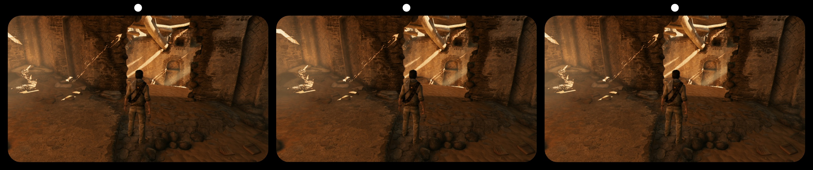
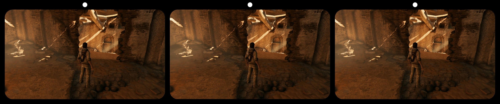
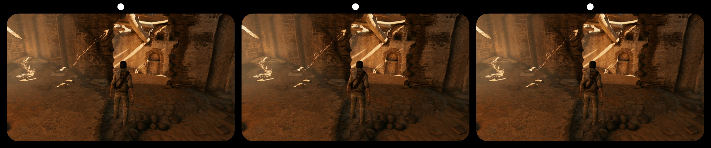
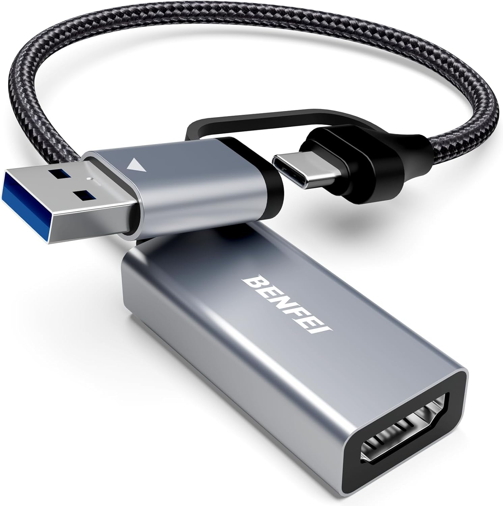
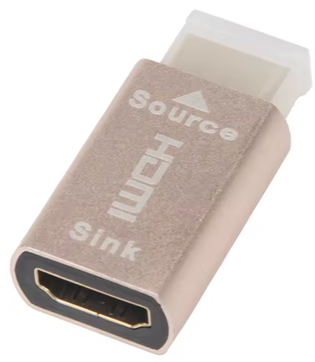
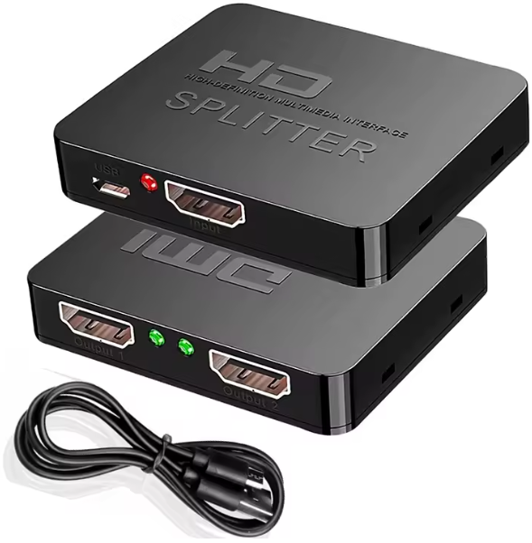

# 3DConsoleBridge

3DConsoleBridge is a project that lets you play native 3D console games (from PS3, PS4, Xbox 360, etc.) on modern glasses-free 3D displays. It uses affordable off-the-shelf hardware and a chain of open software tools to capture the 3D HDMI output from consoles, process it, and make it compatible with glasses-free 3D screens.

The setup works without modifying the console, and also makes it possible to record or stream gameplay using standard software like OBS.

---

## Table of contents

- [Firmware patching guide](#firmware-patching-guide)
- [EDID emulator option](#edid-emulator-option)
- [Hardware connection](#hardware-connection)
- [ShaderGlass setup](#shaderglass-setup)
- [3DToElse_NTM3D details](#3dtoelse_ntm3d-details)
- [NTM3D EDID details](#ntm3d-edid-details)
- [Record using OBS](#record-using-obs)
- [3D TV size settings](#3d-tv-size-settings)
- [Demo videos](#demo-videos)
- [Hardware examples](#hardware-examples)
- [Credits](#credits)

---

## Firmware patching guide

> **⚠️ Warning:** Flashing any firmware is at your own risk. Make backups and verify hardware compatibility before proceeding!

### Download ms213x_flash

Download the MS213x/MS213xS firmware flasher from [steve-m/ms213x_flash](https://github.com/steve-m/ms213x_flash).

### 1. Backup your firmware
Run:
```
ms213x_flash.exe
```
This will create a backup of your capture card’s firmware (e.g. `backup.bin`).

### 2. Patch firmware using MS2130_edid_patcher.py
Run:
```
python3 MS2130_edid_patcher.py backup.bin NTM3D_edid.bin backup_patched.bin
```
`backup.bin` is the firmware you just dumped.  
`NTM3D_edid.bin` is included in the repo. But you can use any 256 byte EDID.  
`backup_patched.bin` is the new firmware with the custom EDID.

### 3. Flash the patched firmware
Flash the patched firmware:
```
ms213x_flash.exe -w backup_patched.bin
```

### Option: Use the premade firmware file
You can also use the premade firmware file `NTM3D_firmware.bin` provided in this repository.  
This file is based on the firmware from [this comment](https://github.com/awawa-dev/HyperHDR/discussions/499?sort=new#discussioncomment-15833082) that is itself based on the original from [awawa-dev/HyperHDR/discussions/729](https://github.com/awawa-dev/HyperHDR/discussions/729) but with the EDID `NTM3D_edid.bin` patched in.

So it includes all fixes from HyperHDR and has the sharpening filter disabled. Read the linked threads for more information.
>Changelog:
> * fixed issue with very dark captured video
> * fixed issue when video source uses limited YUV color space
> * add missing modes e.g. 1080p24, 1080p120... reported to the display
> * ms2130 now reports HDR support
> * ms2130 now reports LLDV support
>
>Latency test:
> * 1080p60 => ~66ms
> * 1080p120 => ~49ms

---

## EDID emulator option

If you already have a capture card and want to use that. You can use an external EDID emulator instead to trick the console to output 3D.
Using an cheap EDID emulator, you can overwrite the EDID that it comes with using ToastyX’s [EDID/DisplayID Writer tool](https://www.monitortests.com/forum/Thread-EDID-DisplayID-Writer).

Flash `NTM3D_edid.bin` to advertise the same features as when using the firmware above.

---

## Hardware connection

**MS2130 capture card setup:**
```
PS3/PS4/Xbox 360 etc → HDMI splitter → MS2130 capture card
```

**EDID emulator setup:**
```
PS3/PS4/Xbox 360 etc → HDMI splitter → EDID emulator → Your capture card
```

---

## ShaderGlass setup

1. Follow the guide here:  
   [ShaderGlass Reddit Guide](https://www.reddit.com/r/Stereo3Dgaming/comments/1qibwpg/friendly_reminder_you_can_use_shaderglass_free_on/)

2. Add [`3DToElse_NTM3D.fx`](3DToElse_NTM3D.fx) from this repo to your ShaderGlass shader folder.

3. Disable 3dGameBridge with CTRl + 2.

4. Set the input format to Frame Packing. If needed you can change the blanking lines slider to correctly cut out the blanking lines.

5. Set output format to Half and SBS.

6. Enable 3DGameBridge with CTRL + 2 to weave the now Half SBS image into 3D.

Video guide:  
<a href="https://www.youtube.com/watch?v=kXILnaeH6N4">

---

## 3DToElse_NTM3D details

The modifications comprise of support for frame packed input and half/full input and output for SBS (Side-by-Side) and TaB (Top-and-Bottom). However, keep in mind that ReShade cannot change the display aspect ratio, so the support uses letter and pillar boxes.

The frame packed input format differ from TaB input in that it will remove the blanking line and correctly scale each eye to compensate for the removed lines.

---

## NTM3D EDID details

`NTM3D_edid.bin` is based on the EDID from the HyperHDR firmware, with the 3D parts extracted from my LG 65UF852V. Some settings were adjusted to better suit the use of 3D.

If you want to inspect the EDID, make changes, or create your own, I can recommend [AW EDID Editor](https://www.analogway.com/products/aw-edid-editor).

---

## Record using OBS

To record or stream gameplay, start an additional ShaderGlass instance *without* 3DGameBridge activated.
Capture the output window of ShaderGlass using OBS.

1. **Enable multiple apps to use the camera:**  
   On Windows 11, you must enable multiple applications to access your capture card/camera device so you can start two instances of ShaderGlass. See guide: [Enable or Disable Multiple Apps to Use Camera in Windows 11](https://www.elevenforum.com/t/enable-or-disable-multiple-apps-to-use-camera-in-windows-11.31199/)

2. **Use Game Capture in OBS:**  
   To ensure that ReShade shader effects are captured correctly, select **Game Capture** mode in OBS when grabbing the ShaderGlass window.

---

## 3D TV size settings

`NTM3D_edid.bin` presents as a 24 inch TV. This was chosen to match the original PS3 3D display size, the screen most developers probably made sure their games looked correct on. The PS3, and likely other consoles, use the TV screen size EDID value to scale 3D depth.
If you always thought that the 3D was weak on the PS3 you probably had this set to the "correct" size for your TV.

Please watch the God of War: Chains of Olympus video below as an example of strong 3D depth, it was played using 17 inches.

The following images show the difference between selecting 17 inch, 27 inch, and 47 inch respectively. No other settings have been changed.

**Previews:**

- **17 inch:**  
    
  [HSBS version](Images/17inch_HSBS.png)

- **27 inch:**  
    
  [HSBS version](Images/27inch_HSBS.png)

- **47 inch:**  
    
  [HSBS version](Images/47inch_HSBS.png)

Feel free to experiment with the TV size setting on the PS3. In my limited testing, going lower than around 17 inches can start introducing visual glitches or bugs.

---

## Demo videos

<table>
  <tr>
    <td>
      <b>Xbox 360 - Halo Anniversary</b><br>
      <a href="https://www.youtube.com/watch?v=l8bQE9-gguo">
        
      </a>
    </td>
    <td>
      <b>PS3 - Uncharted 3</b><br>
      <a href="https://www.youtube.com/watch?v=It2Peu-Q7K8">
        
      </a>
    </td>
  </tr>
  <tr>
    <td>
      <b>PS3 - God of War: Chains of Olympus</b><br>
      <a href="https://www.youtube.com/watch?v=xAMcjXU_OB0">
        
      </a>
    </td>
    <td>
      <b>PS4 - Zombie Army Trilogy</b><br>
      <a href="https://www.youtube.com/watch?v=urB5LrObXTU">
        
      </a>
    </td>
  </tr>
</table>

---

## Hardware examples

MS2130-based capture card:  


EDID emulator:  


HDMI splitter that will strip HDCP:  


---

## Credits

- [3DToElse.fx (BlueSkyDefender)](https://github.com/BlueSkyDefender/Depth3D/blob/master/Other%20%20Shaders/3DToElse.fx)
- [ShaderGlass by mausimus](https://github.com/mausimus/ShaderGlass)
- [ShaderGlass guide discussion](https://www.reddit.com/r/Stereo3Dgaming/comments/1qibwpg/friendly_reminder_you_can_use_shaderglass_free_on/)
- [ms213x_flash](https://github.com/steve-m/ms213x_flash)
- [ms2130_patcher](https://github.com/steve-m/ms2130_patcher)
- [HyperHDR discussion #729](https://github.com/awawa-dev/HyperHDR/discussions/729)
- [HyperHDR discussion #499](https://github.com/awawa-dev/HyperHDR/discussions/499?sort=new#discussioncomment-15833082)
- [EDID DisplayID Writer](https://www.monitortests.com/forum/Thread-EDID-DisplayID-Writer)
- [Enable or Disable Multiple Apps to Use Camera in Windows 11](https://www.elevenforum.com/t/enable-or-disable-multiple-apps-to-use-camera-in-windows-11.31199/)
- [AW EDID Editor](https://www.analogway.com/products/aw-edid-editor)

---

For troubleshooting or questions, open an issue in this repository.
